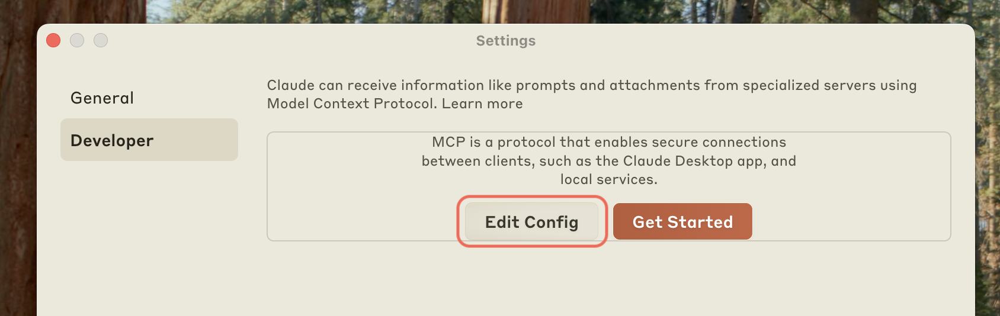
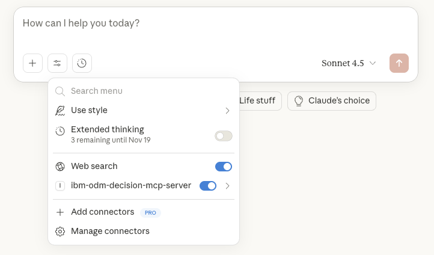
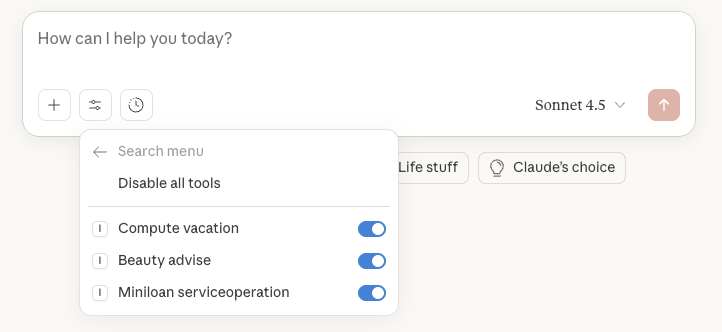

# Claude Desktop Integration Guide

## Part 1: Installation & Configuration

### Prerequisites

- Claude Desktop ([Download](https://claude.ai/download))


### Step 1: Install Git, Python and uv

- [Install Git](https://git-scm.com/install/windows) (you can keep the default options)
- Install Python 3.13 or later
- Install uv:
  - on macOS: 
    ```shell
    brew install uv
    ```
  - on Windows: 
    - in Powershell, run the command described in [installing uv](https://docs.astral.sh/uv/getting-started/installation/)
    - once `uv` is installed, open a new Powershell window/tab, and run the command below:
      ```powershell
      uvx --from git+https://github.com/DecisionsDev/ibm-odm-decision-mcp-server ibm-odm-decision-mcp-server
      ``` 
    - wait for `uvx` to complete downloading all the Python packages required by Decision MCP server
    - you can then safely stop the `uvx` command line

- Verify your Python and `uv` installation:

    **For macOS/Linux (in Terminal):**
    ```bash
    uv python list
    ```

    **For Windows (in PowerShell):**
    ```powershell
    uv python list
    ```

### Step 2: Install Docker Rancher Desktop (Optional)

If you don't have Docker installed yet, we recommend using Rancher Desktop which provides Docker and Kubernetes in a single application.

#### For Windows:

1. **Install WSL 2 (Windows Subsystem for Linux)**:
   - Open PowerShell as Administrator and run:
     ```powershell
     wsl --install
     ```
   - Restart your computer when prompted
   - Open PowerShell as Administrator and run:
     ```powershell
     wsl --install
     ```
   - After restart, a Linux distribution (usually Ubuntu) will be installed automatically
   - Set up your Linux username and password when prompted (ex: admin/admin)
     

2. **Install Rancher Desktop**:
   - Download the installer from [Rancher Desktop website](https://rancherdesktop.io/)
   - Run the installer and follow the on-screen instructions
   - Run Rancher Desktop
     - Disable Enable Kubernetes (Not needed for this demonstration)
     - Wait until the initialization was finished.
     - Ensure WSL integration is enabled
     - Select "dockerd" as the container runtime (not "containerd")
   - After installation, Rancher Desktop will start automatically

3. **Verify Installation**:
   - Open a new PowerShell windows
   - Run the following commands:
     ```powershell
     docker --version
     docker-compose --version
     ```
   - These commands should display the installed versions, confirming that Docker and Docker Compose are properly installed

#### For macOS:

1. **Install Rancher Desktop**:
   - Download the installer from [Rancher Desktop website](https://rancherdesktop.io/)
   - Open the downloaded .dmg file and drag Rancher Desktop to your Applications folder
   - Launch Rancher Desktop from your Applications folder
   - Select "dockerd" as the container runtime (not "containerd")

2. **Verify Installation**:
   - Open Terminal
   - Run the following commands:
     ```bash
     docker --version
     docker-compose --version
     ```
   - These commands should display the installed versions, confirming that Docker and Docker Compose are properly installed

### Step 3: Run ODM Locally (Optional)

If you want to use a local ODM instance for development or testing, 

- clone this repository,
```bash
  git clone https://github.com/DecisionsDev/ibm-odm-decision-mcp-server.git
  cd ibm-odm-decision-mcp-server
 ```
- and run:

    **For macOS/Linux (in Terminal):**
    ```bash
    docker-compose up
    ```
    
    **For Windows (in PowerShell):**
    ```powershell
    docker-compose up
    ```
    
  If the command is successful, you should see:
    ```
    upload_materials  | ✅ ODM Ready for MCP Server
    upload_materials exited with code 0
    ```

- Once the containers are running, the ODM web consoles are available at [http://localhost:9060](http://localhost:9060) using the default credentials:

  - **Username:** `odmAdmin`
  - **Password:** `odmAdmin`

This ODM instance will be available for the MCP Server, pre-populated with sample data for testing and development purposes.

### Step 4: Configure Claude Desktop
1. Open Claude Desktop Settings:
   - On macOS, click the Claude menu in the top menu bar and select **Settings**.
   - On Windows, access **Settings** from the Claude application.

1. Navigate to the **Developer** tab and click **Edit Config**:


1. This opens a window allowing you to open the configuration file:
   - macOS: `~/Library/Application Support/Claude/claude_desktop_config.json`
   - Windows: `%APPDATA%\Claude\claude_desktop_config.json`

1. Edit the configuration file and add the following configuration:
   ```json
   {
     "mcpServers": {
       "ibm-odm-decision-mcp-server": {
         "command": "uvx",
         "args": [
           "--from",
           "git+https://github.com/DecisionsDev/ibm-odm-decision-mcp-server",
           "ibm-odm-decision-mcp-server",
           "--url",
           "http://localhost:9060/res",
           "--username", "odmAdmin"
         ],
         "env": {
          "PASSWORD": "odmAdmin"
         },
       }
     }
   }
   ```
1. Restart Claude Desktop:

    Simply closing the window is not enough, Claude Desktop must be stopped and restarted:
    - on macOS: Claude > Quit
    - on Windows: File > Exit

Refer to the [Configuration Parameters Table](../README.md#configuration-parameters-table) for a list of supported environment variables and CLI arguments.

## Part 2: Demo Walkthrough

This walkthrough demonstrates how Claude Desktop can interact with IBM ODM Developer Edition through the Decision MCP Server. The scenario showcases three decision services:

1. **Vacation Policy Decision Service** – Computes vacation days based on company policy.
2. **Beauty Advice Decision Service** – Provides personalized beauty recommendations.
3. **Agent Miniloan Service** – Assess loan requests.

### Step-by-Step Scenario

#### 1. Claude Connects to ODM

Once Claude Desktop is configured with the MCP Server, it automatically connects to the ODM Developer Edition. The MCP Server retrieves and exposes the available decision services as Claude tools.

✅ To see all the tools listed in Claude Desktop, proceed as follows:
- first click the settings icon, and you should see:


- then click `ibm-odm-decision-mcp-server`, and you should see:


#### 2. User Starts a Conversation

The user initiates a conversation in Claude with a natural language request:

> **User:** "I need to compute my vacation."

Claude recognizes this intent and activates the `computeVacation` tool.

#### 3. Claude Gathers Required Inputs

Claude prompts the user for the necessary information:

> **Claude:** "Can you provide your employee ID and hiring date?"

The user responds with:

> **User:** "Employee ID: 12345, Hiring Date: 2018-06-01"

#### 4. ODM Decision Service is Invoked

Claude sends the input to the ODM decision service via the MCP Server. The service processes the request and returns a result, such as:

> **ODM Response:** `{  "timeoffDays": "33 days per year" }`

Claude interprets and presents the result:

> **Claude:** "Based on your hiring date, you are entitled to 33 time-off days."

#### 5. User Tries Another Input

The user can experiment with different inputs:

> **User:** "What if I was hired on 2000-01-01?"

Claude reuses the tool, sends the new input, and returns the updated result.

#### 6. Switching to Beauty Advice

The user can now try a different tool:

> **User:** "Can I get some beauty advice?"

Claude activates the `beauty_advice` tool and may ask follow-up questions (e.g., skin type, preferences) before invoking the ODM service and returning personalized recommendations.

### Demo Notes

- This scenario demonstrates how Claude can dynamically interact with multiple decision services.
- The tools are exposed automatically by the MCP Server based on the ODM configuration.
- You can extend this setup with additional decision services or integrate it into broader workflows using Watson Orchestrate.
